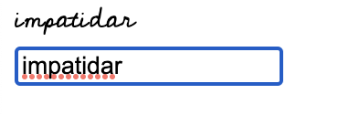

# Digital Signature from text.

A React library for creating digital signatures from text.

#Demo

#Installation

npm install --save digitalsignature-generator

#Usage

Use the FontConverter component to convert your text to a signature.
Pass the text to the FontConverter component to generate a signature.